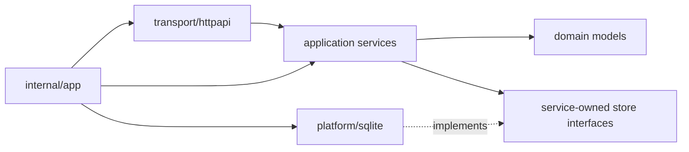

<!--
File Name: modules.md
Purpose: Documents backend module ownership, dependencies, and consumers.
Responsibilities:
- Provide top-level module inventory.
- Cross-reference upstream dependencies and downstream consumers.
- Point contributors to folder-level READMEs.
Inputs / Outputs: Markdown module map consumed by backend contributors.
Dependencies: Folder READMEs and source package layout.
Side Effects: None.
Critical Notes: Update when modules are added, removed, or re-owned.
-->

# Backend Modules

| Module | Folder README | Responsibility | Upstream dependencies | Downstream consumers |
| --- | --- | --- | --- | --- |
| Runtime | [`internal/app`](../internal/app/README.md) | Compose backend dependencies, migrations, routes, lifecycle | Config, SQLite, auth, ingestion, engagement, platformops | `cmd/server`, all HTTP clients |
| Auth | [`internal/auth`](../internal/auth/README.md) | Users, sessions, profile, password, auth middleware | Config, ID, SQLite, bcrypt | Protected route groups, frontend auth state |
| Engagement | [`internal/engagement`](../internal/engagement/README.md) | Bookmarks, alerts, notifications | Events, SQLite, ingestion property IDs | User notification APIs, operations visibility |
| Engine | [`internal/engine`](../internal/engine/README.md) | Worker pool, retry, error classification | Context/time only | Ingestion scheduler and retryable workflows |
| Fetcher | [`internal/fetcher`](../internal/fetcher/README.md) | Outbound HTTP, challenge handling, telemetry | HTTP/TLS runtime and source URLs | Ingestion connectors |
| Ingestion | [`internal/ingestion`](../internal/ingestion/README.md) | Sources, properties, runs, fields, tags, analytics, scheduler | Fetcher, parser, engine, SQLite, ID | Frontend backoffice APIs, engagement, platformops |
| Parser | [`internal/parser`](../internal/parser/README.md) | Normalize HTTP JSON and HTML payloads | HTML/JSON parser libraries | Ingestion connectors |
| Platform | [`internal/platform`](../internal/platform/README.md) | Shared config, events, HTTP helpers, IDs, object storage, SQLite | Standard library, SQLite, optional AWS SDK | All application and transport modules |
| Platform operations | [`internal/platformops`](../internal/platformops/README.md) | Settings, backup/restore, scheduler summaries, deliveries | Events, config, scheduler, SQLite | Backoffice operations UI and operators |
| Seed | [`internal/seed`](../internal/seed/README.md) | Deterministic local/demo data | SQLite store contracts and domain models | Local development helpers |

## Dependency direction

## Where to change code

| Change type | Primary location | Documentation to update |
| --- | --- | --- |
| Endpoint shape | `transport/httpapi` | API contracts, file header, handler comments |
| Business rule | `application` | Folder README, affected function comments |
| Query/schema detail | `internal/platform/sqlite` | SQLite README, migration/backup docs |
| Domain contract | `domain` | Module README and API/data-flow docs when exposed |
| Startup behavior | `internal/app/runtime.go` | Overview, architecture, environment guides |
