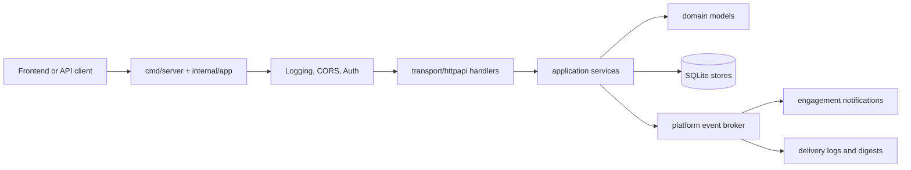

<!--
File Name: overview.md
Purpose: Gives a root-level backend system overview and entry-point map.
Responsibilities:
- Explain backend ownership and active runtime shape.
- Point engineers to the first files and folders to inspect.
- Summarize high-level workflows and operational boundaries.
Inputs / Outputs: Markdown architecture overview consumed by backend contributors.
Dependencies: internal/app runtime, module docs, API contracts, environment guides.
Side Effects: None.
Critical Notes: Update when runtime ownership or route groups change.
-->

# Backend Overview

The backend is one Go HTTP process backed by SQLite. It owns authenticated operator APIs, property tracking, ingestion, engagement workflows, platform operations, backups, and operational summaries.

## System responsibilities

- Authenticate users and authorize protected routes.
- Manage sources, properties, snapshots, property runs, fields, tags, and analytics datasets.
- Manage bookmarks, alert rules, notifications, and engagement records.
- Manage platform settings, workspace backup/restore, reset, migration status, and integration delivery logs.
- Protect SQLite migrations with integrity checks and pre-migration backups when safe-auto migration is enabled.

## Primary entry points

| Concern | Start here | Then inspect |
| --- | --- | --- |
| Process startup | [`../cmd/server/main.go`](../cmd/server/main.go) | [`../internal/app/runtime.go`](../internal/app/runtime.go) |
| Runtime wiring | [`../internal/app/runtime.go`](../internal/app/runtime.go) | Module `transport/httpapi` folders |
| Auth flow | [`../internal/auth/README.md`](../internal/auth/README.md) | Auth application and transport packages |
| Property ingestion | [`../internal/ingestion/README.md`](../internal/ingestion/README.md) | Application, connector, parser, fetcher packages |
| Persistence | [`../internal/platform/sqlite/README.md`](../internal/platform/sqlite/README.md) | SQLite store and migration files |
| Operations | [`../internal/platformops/README.md`](../internal/platformops/README.md) | Platform operations application and transport packages |

## High-level workflow map

## Change navigation rule

1. Read the folder README.
2. Read the file header.
3. Read the function/type documentation above the symbol being changed.
4. Follow cross-links to upstream dependencies and downstream consumers.
5. Update docs and comments in the same change as behavior changes.
