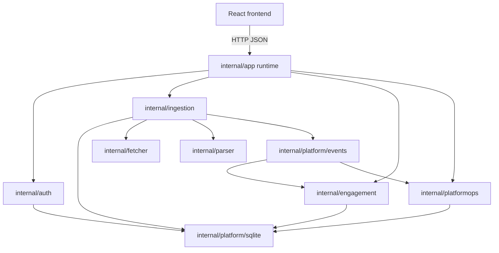
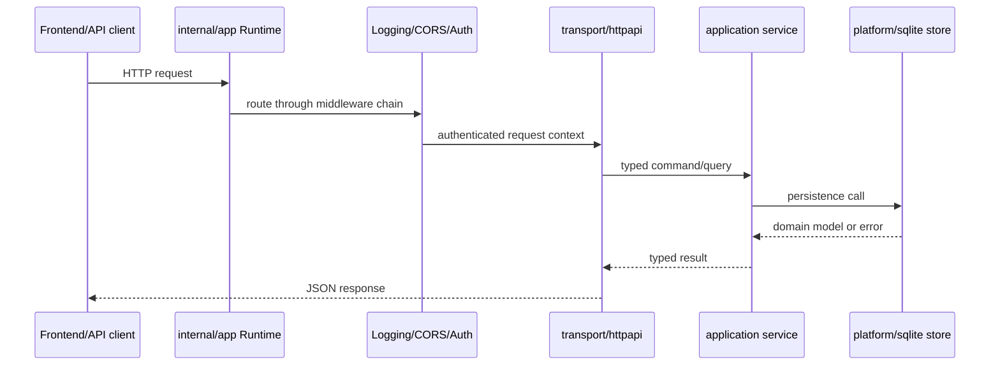
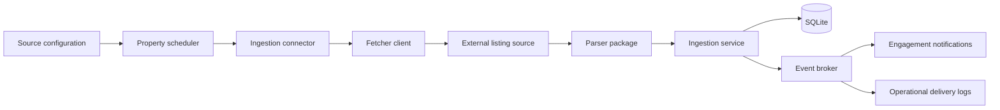
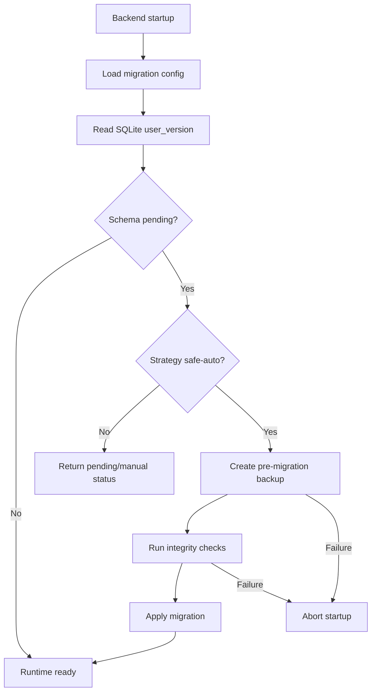

<!--
File Name: visual-proof.md
Purpose: Records before/after documentation evidence and rendered visual artifacts for the backend documentation pass.
Responsibilities:
- Show documentation coverage improvements.
- Provide Mermaid diagrams for reviewers to render.
- Identify key risk areas surfaced by the documentation pass.
Inputs / Outputs: Markdown proof artifact consumed by pull request reviewers.
Dependencies: Source file headers, folder READMEs, backend diagrams, environment docs.
Side Effects: None.
Critical Notes: Mermaid diagrams render in GitHub markdown and should stay syntactically valid.
-->

# Visual Proof and Coverage Evidence

## Before / after comparison

| Area | Before | After |
| --- | --- | --- |
| Folder READMEs | Backend folders did not consistently include local README navigation. | Every backend source folder includes a `README.md` with purpose, components, interactions, constraints, and a Mermaid map. |
| File headers | Go source files began directly with `package` declarations. | Go source files begin with standardized file-level headers. |
| Function/type docs | Many functions and types had terse or missing comments. | Top-level Go functions and types include structured documentation blocks. |
| Environment docs | Setup information was split between root README and scattered config knowledge. | Dedicated development and production guides document prerequisites, variables, run commands, failure modes, and operational assumptions. |
| Visual documentation | Data-flow docs were plain-text lists. | Mermaid component, sequence, data-flow, and workflow diagrams are included in backend docs. |

## File header evidence

```go
/**
 * File: internal/app/runtime.go
 *
 * Purpose:
 * Composes the backend runtime, dependencies, routes, and lifecycle behavior.
 */
package app
```

## Function/type documentation evidence

```go
/**
 * Purpose:
 * Performs the New operation for this backend package.
 *
 * Parameters:
 * - ctx context.Context, cfg config.Config, logger *slog.Logger
 *
 * Returns:
 * - (*Runtime, error)
 */
func New(ctx context.Context, cfg config.Config, logger *slog.Logger) (*Runtime, error) {
```

## Folder README structure evidence

```text
README.md
├── Purpose
├── Contained components
├── Interactions with other folders
├── Notable patterns and constraints
└── Visual map
```

## Component relationship diagram



## Request lifecycle sequence



## Ingestion data flow



## Backup and migration workflow



## Key risk areas identified

| Risk | Why critical | What can break | Failure conditions |
| --- | --- | --- | --- |
| SQLite migration and backup safety | Schema changes mutate durable data | Startup, data recovery, workspace integrity | Missing backup directory, failed integrity check, unsafe migration strategy |
| Scheduler concurrency | Multiple property runs can compete for source/domain capacity | Rate limits, duplicate runs, stale status | High global concurrency, repeated scheduler ticks, long-running fetches |
| Bearer session handling | Tokens authorize protected APIs | User data access, profile mutations, operations endpoints | Token disclosure, weak bootstrap credentials, stale sessions |
| Workspace restore/reset | Operations mutate or replace persisted workspace state | Data loss, inconsistent frontend state | Invalid backup payload, concurrent writes, operator misuse |
