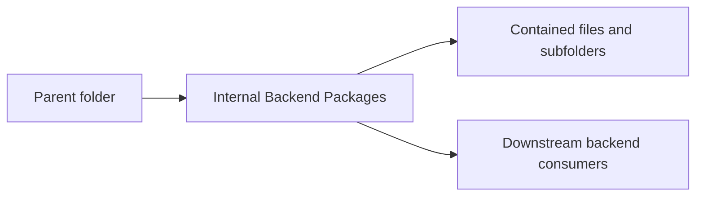

<!--
File Name: README.md
Purpose: Provides folder-level documentation for `internal`.
Responsibilities:
- Explain this folder's role in the backend architecture.
- List contained components and downstream relationships.
- Capture constraints that contributors must preserve.
Inputs / Outputs: Markdown documentation consumed by backend contributors.
Dependencies: Parent and child folder documentation plus linked source files.
Side Effects: None.
Critical Notes: Keep this README synchronized with source changes in this folder.
-->

# Internal Backend Packages

## Purpose

Contains all private Go packages that implement backend behavior.

## Contained components

Runtime assembly, domains, services, transports, persistence, parsers, fetchers, and shared platform utilities.

### Subfolders

- [`app/`](./app/README.md)
- [`auth/`](./auth/README.md)
- [`engagement/`](./engagement/README.md)
- [`engine/`](./engine/README.md)
- [`fetcher/`](./fetcher/README.md)
- [`ingestion/`](./ingestion/README.md)
- [`parser/`](./parser/README.md)
- [`platform/`](./platform/README.md)
- [`platformops/`](./platformops/README.md)
- [`seed/`](./seed/README.md)

## Interactions with other folders

Only backend commands import this tree; frontend interacts through HTTP contracts.

## Notable patterns and constraints

- Keep package dependencies directed inward through interfaces where application services cross persistence or transport boundaries.
- Keep HTTP request/response shaping in `transport/httpapi` folders and business decisions in `application` folders.
- Keep domain models free of transport concerns unless explicit JSON contracts are part of persisted API behavior.
- Update file headers, symbol comments, and this README in the same change when behavior changes.

## Visual map

