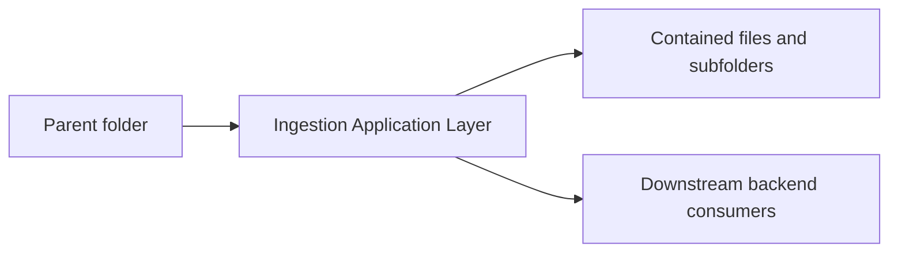

<!--
File Name: README.md
Purpose: Provides folder-level documentation for `internal/ingestion/application`.
Responsibilities:
- Explain this folder's role in the backend architecture.
- List contained components and downstream relationships.
- Capture constraints that contributors must preserve.
Inputs / Outputs: Markdown documentation consumed by backend contributors.
Dependencies: Parent and child folder documentation plus linked source files.
Side Effects: None.
Critical Notes: Keep this README synchronized with source changes in this folder.
-->

# Ingestion Application Layer

## Purpose

Coordinates source ingestion, property tracking, fields, tags, intelligence, and scheduler use cases.

## Contained components

Services, scheduler, transformations, tests.

### Files

- `field_service.go`
- `field_service_test.go`
- `intelligence.go`
- `intelligence_test.go`
- `property_scheduler.go`
- `property_scheduler_test.go`
- `property_service.go`
- `property_service_test.go`
- `service.go`
- `service_test.go`
- `tag_service.go`
- `tag_service_test.go`
- `transform_test.go`

## Interactions with other folders

Depends on ingestion domain, engine, id generation, fetch/parser collaborators, and persistence stores.

## Notable patterns and constraints

- Keep package dependencies directed inward through interfaces where application services cross persistence or transport boundaries.
- Keep HTTP request/response shaping in `transport/httpapi` folders and business decisions in `application` folders.
- Keep domain models free of transport concerns unless explicit JSON contracts are part of persisted API behavior.
- Update file headers, symbol comments, and this README in the same change when behavior changes.

## Visual map

