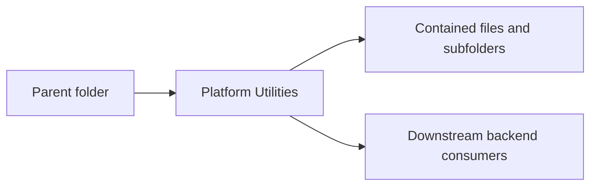

<!--
File Name: README.md
Purpose: Provides folder-level documentation for `internal/platform`.
Responsibilities:
- Explain this folder's role in the backend architecture.
- List contained components and downstream relationships.
- Capture constraints that contributors must preserve.
Inputs / Outputs: Markdown documentation consumed by backend contributors.
Dependencies: Parent and child folder documentation plus linked source files.
Side Effects: None.
Critical Notes: Keep this README synchronized with source changes in this folder.
-->

# Platform Utilities

## Purpose

Contains shared backend infrastructure primitives.

## Contained components

Config, events, HTTP helpers, id generation, object store, and SQLite persistence.

### Subfolders

- [`config/`](./config/README.md)
- [`events/`](./events/README.md)
- [`httpapi/`](./httpapi/README.md)
- [`id/`](./id/README.md)
- [`objectstore/`](./objectstore/README.md)
- [`sqlite/`](./sqlite/README.md)

## Interactions with other folders

Consumed by all domain modules through narrow package APIs.

## Notable patterns and constraints

- Keep package dependencies directed inward through interfaces where application services cross persistence or transport boundaries.
- Keep HTTP request/response shaping in `transport/httpapi` folders and business decisions in `application` folders.
- Keep domain models free of transport concerns unless explicit JSON contracts are part of persisted API behavior.
- Update file headers, symbol comments, and this README in the same change when behavior changes.

## Visual map

