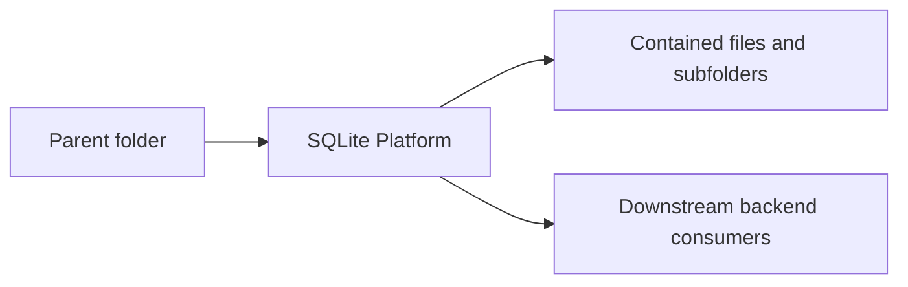

<!--
File Name: README.md
Purpose: Provides folder-level documentation for `internal/platform/sqlite`.
Responsibilities:
- Explain this folder's role in the backend architecture.
- List contained components and downstream relationships.
- Capture constraints that contributors must preserve.
Inputs / Outputs: Markdown documentation consumed by backend contributors.
Dependencies: Parent and child folder documentation plus linked source files.
Side Effects: None.
Critical Notes: Keep this README synchronized with source changes in this folder.
-->

# SQLite Platform

## Purpose

Owns persistence, schema, migration safety, backup, and restore behavior.

## Contained components

DB opening, migrations, stores, field store, backup store, and tests.

### Files

- `backup_store.go`
- `db.go`
- `db_test.go`
- `field_store.go`
- `migration_safety.go`
- `store.go`

## Interactions with other folders

Consumed by runtime and all application services through store interfaces.

## Notable patterns and constraints

- Keep package dependencies directed inward through interfaces where application services cross persistence or transport boundaries.
- Keep HTTP request/response shaping in `transport/httpapi` folders and business decisions in `application` folders.
- Keep domain models free of transport concerns unless explicit JSON contracts are part of persisted API behavior.
- Update file headers, symbol comments, and this README in the same change when behavior changes.

## Visual map

